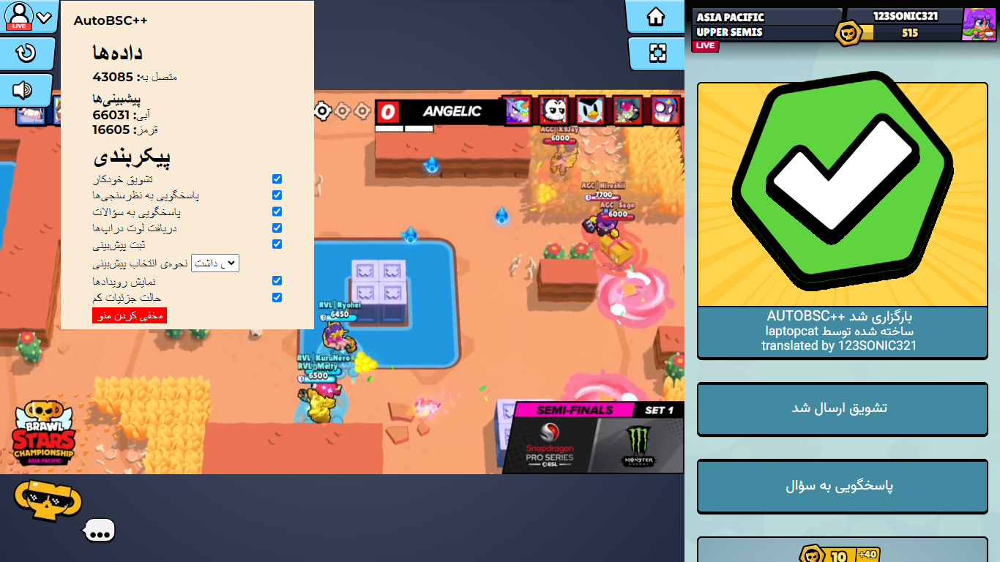

# AutoBSC++

Want all the Starr Drops, sprays and coins, but don't have the time to watch the stream, or it just doesn't match the timezone where you live? AutoBSC++ is here to help you!

AutoBSC++ can automatically completes the events during the stream, including Cheers, Polls (choosing MVP), Quizzes and Match Predictions.

Tested on April Monthly Finals 2024, but should work on other Championship streams as well.

## Quick Start

1. Install [Tampermonkey](https://www.tampermonkey.net/).

2. Install AutoBSC by clicking [here](https://update.greasyfork.org/scripts/491375/AutoBSC.user.js).

3. Open the stream page on https://event.supercell.com/brawlstars/

4. If "AutoBSC++ loaded" is shown in the event logs, then it's working. Now you can just leave the tab open and let it do the work for you.

## Differences from AutoBSC
This project is based on [AutoBSC](https://github.com/CatMe0w/AutoBSC), but has many differences from it

- AutoBSC++ has an overlay showing data and allowing you to quickly configure the script
- Quizzes are always answered correctly
- Many different ways to autopredict: always blue/red, random team or pick same as majority
- Automatically collect loot drops
- DOM-based interactions (ensures stuff, such as displaying your points always works)

## License

MIT License
